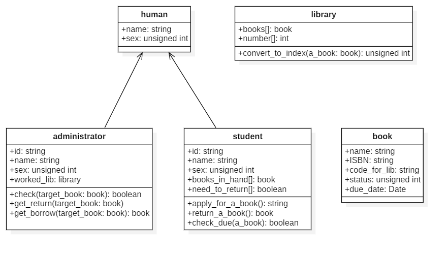
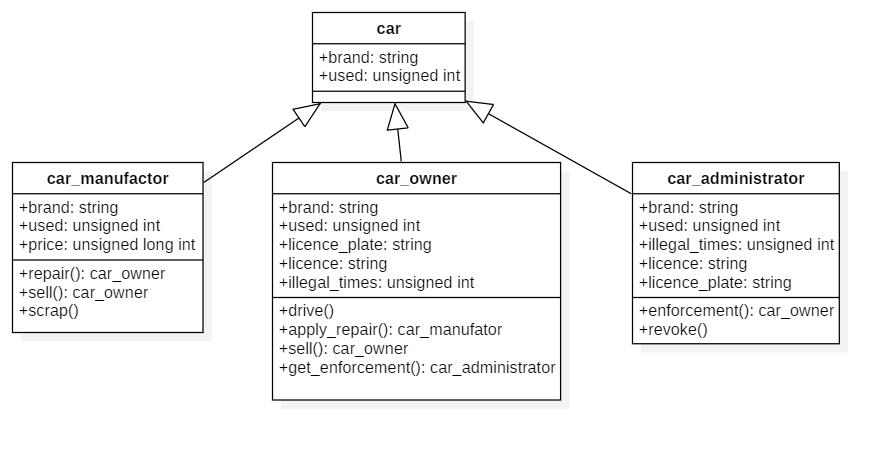

### 第四课作业

##### 借还书系统

如下图所示

关于上面的UML图的说明

首先分为`human`，`library`和`book`几个类

1. `human`的属性包括`string`型的`name`，以及`unsigned int`型的`sex`（比如说，`sex=0`表示男性，`sex=1`表示女性)；

2. `book`的属性包括`string`型的`name`，`string`型的`ISBN`编号，`string`型的`code_for_lib`编号（图书馆使用的书籍编号往往是与ISBN号不同的另一套），以及`unsigned int`型的`status`（比如说，`status=0`表示没被借走，1表示被借走，2表示因其他原因暂时无法借阅……）
3. `library`的属性包括book的大数组以及每个book现存的数量。它的方法包括将book的图书馆编号转换为book数组的索引，从而找到book对应的位置。

然后`human`分出了两个之类，分别为图书管理员`administrator`和学生`student`

1. 管理员的属性包括`string`型的`id`，这个就是每个管理员的工号；继承`human`父类的`string`型的`name`以及`unsigned int` 型的`sex`；现在工作的图书馆`library`等等
2. 管理员的方法包括`check（book）`，此方法用于检查`student`申请借阅的书现在能不能借，返回布尔值代表能借与否；`get_return（book）`方法用于接受并处理`student`还回来的书，处理方式包括但不限于：检查书是否完整，如果书破损严重的话就得将书的`status`改成特殊状态，否则将它改成可以借的状态
3. 学生的属性包括`string`型的`id`，表示学号；`name`和`sex`是继承自父类的；`books_in_hand`表示当前持有的书的队列，`needs_to_return`与前一个数组相照应，如果`books_in_hand`的某本书要到期，这个数组对应的位置就会改为`true`，否则默认为`false`
4. 学生的方法包括：`apply_for_a_book`，将`string`类型的ISBN号作为返回值传递给图书馆管理员，用来申请借阅某本书；`return_a_book`，将`books_in_hand`的某本书还回去，传递给图书馆管理员；`check_due`用来查看书是否过了借阅期限，提前设置好一个还书阈值，等到借阅期限相差低于此阈值，就说明该还书了，使用`boolean`返回值修改`need_to_return`的值，在还书的时候检查一下此结构对应的那本书是否到了还回去的时候了。

##### 驾照系统

首先声明：我没开过车，不知道我的设定符不符合常识

如下图所示

首先定义一个car的大类，这个类的内容有表示厂家的string类型的brand，以及它的崭新程度used（比如说如果这个车是几成新，这个used变量就是几，全新的车是10）

然后car生成三个子类`car_manufactor`, `car_owner`, `car_administrator`，分别代表车的厂家、车主以及交管机构。

1. 厂家的属性除了继承自父类的`brand`和`used`之外，还有代表价格的`unsigned long int`类型的`price`
2. 厂家的方法有修理函数`repair()`、出售函数`sell()`等。比如说`repair()`可以将car的`used`的数值上升。这几个方法的返回值都是`car_owner`，这是因为将车子进行服务之后就会将车还给车主。此外方法`scrap()`用于报销`used`过低的车
3. 车主的属性除了继承自父类的`brand`和`used`之外，还有字符串类型的车牌号`licence_plate`，以及绑定的驾照`string`型的`licence`。此外它还有一个用来记录违法次数的无符号整型变量`illegal_times`。
4. 车主的方法有`drive()`表示行驶，此函数会慢慢降低`used`的值直到0为止；方法`apply_repair()`返回一个`car_manufactor`的类型，表示给厂家送修；方法`apply_upgrade()`用于向厂家给车辆进行升级换新，因此它的返回值也是`car_manufactor`。方法`sell()`用于将车二手出售卖给别人，返回值是`car_owner`。方法`get_enforcement()`是表示车主被交警抓了，因此返回值是`car_administrator`.
5. 交管局的属性除了`brand`和`used`之外，还有和owner一样的属性`string`型的`licence`和`licence_plate`，即驾照和车牌号，此外它还有一个违章程度的属性`illegal_times`，为`unsigned int`类型，车主每被抓一次就记录一个分数，直到达到一个预设的阈值为止
6. 交管局的方法有：`enforcement()`返回值为`car_owner`，用于将违法的车进行违法记录，然后返回；`revoke()`方法是当车的违法次数过多之后将车扣押、车牌以及执照进行吊销

