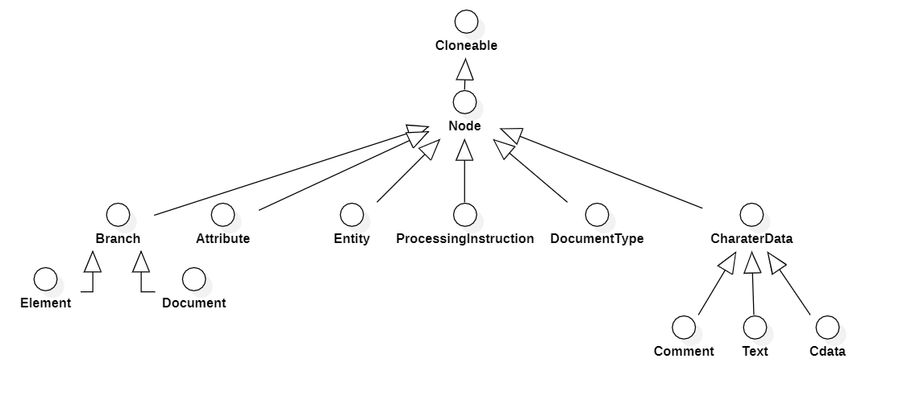
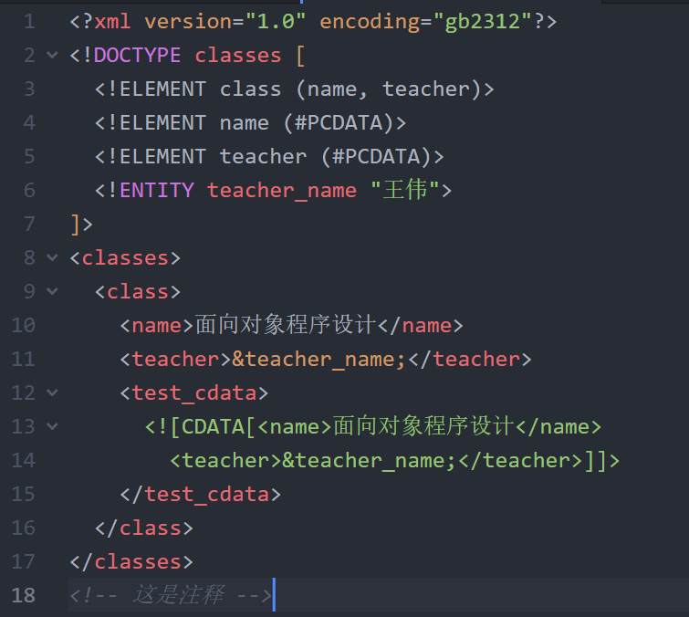
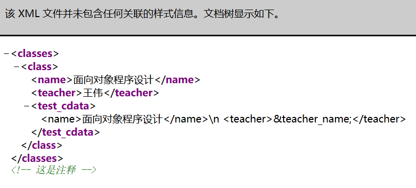
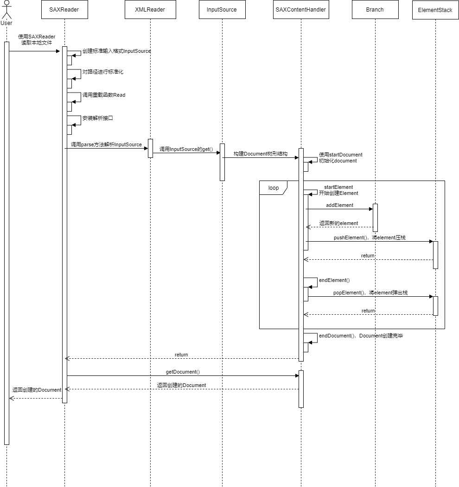
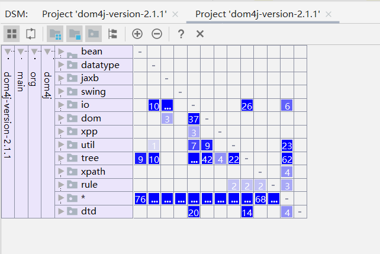
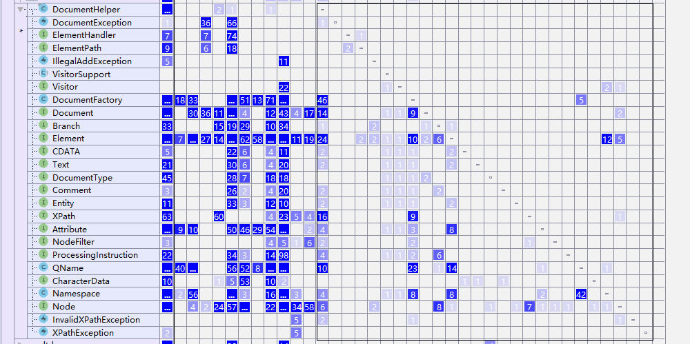
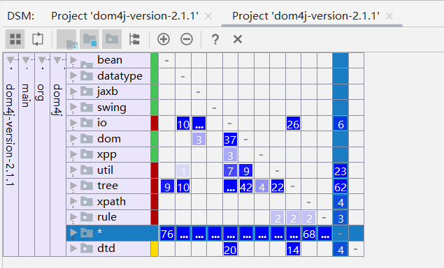
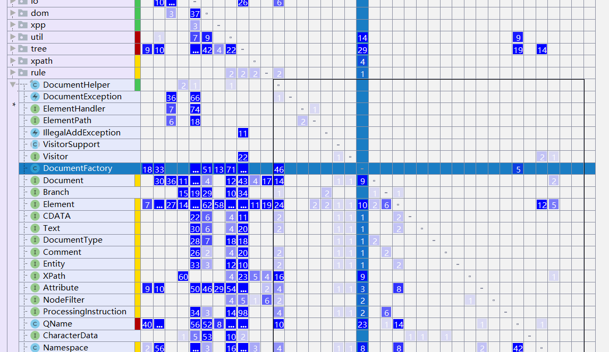

### DOM4j的核心流程设计分析

本阶段中，主要分析的对象是dom4j功能运作下的具体执行流程，由于dom4j的核心在于将XML转化为Document树结构的过程，因此这里主要是分析上一节里面包括SAXReader在内的解析xml文件的过程。

#### 主要类的类间关系

首先是本阶段核心流程中涉及到的部分类/接口的关系图：




这张类间关系的图有几个特点，一个就是它形成了明显的树状结构，很有层次感，位于最上面的`Cloneable`接口是java的一个比较基本的接口，用于支持在堆中clone一个和原对象一模一样的对象，在此不是我们关注的重点。

位于这个树状关系图的次根部的接口`Node`，由其余接口直接或间接继承，此接口定义了dom4j生成的树结构中所有XML节点的多态行为——一个节点可以被输出为XML格式，可以从文件中分离，还可以对它求XPath表达式的值。

上一节主要讨论到的`Element`节点和`Document`节点继承自`Branch`节点，此接口定义了节点的常见行为——一个节点可以包含子节点。此接口也支持以多态方式处理元素和文档；`Attribute`接口定义了一个XML文件的属性。属性可以具有名称，还可以具有可选属性：名称空间`namespace`和值`value`等等；`Entity`接口定义了一个XML文件的实体；`ProcessingInstruction`接口定义了处理XML文件的指令；`DocumentType`接口定义了一个XML的文档种类；`CharaterData`接口用于字符节点，其子接口`CDATA`，`Comment`和 `Text`分别定义了XML文件的3种字符属性：CData、注释和文字内容。

另一个特点就是，可以看到这里面基本上都是接口。这就体现了接口与实现分离的思想，对于程序的拓展、代码的可读性以及目标的实现都是有着正向的帮助的。

为什么我们关心上面这些类/接口的关系呢？还得从XML的格式说起：这些接口对应着XML文件各个组成部分。



这是因为一个较为完整的XML文件是由Document、Element、Text、Cdata、Comment等元素组成的。比如说上面这个XML文件，整个文件叫做`Document`

```xml
<?xml version="1.0" encoding="gb2312"?>
```

这一行叫作`ProcessingInstruction`

```xml
<!DOCTYPE classes [
  <!ELEMENT class (name, teacher)>
  <!ELEMENT name (#PCDATA)>
  <!ELEMENT teacher (#PCDATA)>
  <!ENTITY teacher_name "王伟">
]>
```

这几行叫做`DocumentType`，其中最下面的`<!ENTITY teacher_name "王伟">`叫做`Entity`，

```xml
<name>面向对象程序设计</name>
```

这样在`classes`里面每个标签覆盖的就是`Element`，其中文字`面向对象程序设计`叫做`Text`

```xml
<![CDATA[<name>面向对象程序设计</name>
<teacher>&teacher_name;</teacher>]]>
```

这个叫做`CData`

```xml
<!-- 这是注释 -->
```

这个是注释`Comment`的格式。这个文件在Firefox里面打开长这样:



可以看到，除了注释部分为绿色之外，被高亮的部分很明显是语法的标识符，而文字内容都是黑色的，这些黑色的文字包括了上面提到的`Cdata`和`text`，加上注释`Comment`一起被称作`CharacterData`，即字符数据。

可以看到，Dom4j在声明接口的时候对XML文件里面的各个组成部分做了单独的接口命名，也就是体现了面向对象SOLID原则中的单一职责原则。


#### 解析XML文件的主要流程

正如上一章的分析，在dom4j执行的过程中，最核心的步骤就是将xml解析为树结构的过程。这里还是以解析一个本地xml文件开始谈起，见下面的简易序列图



由于在安装各种"过滤器"的时候加了很多的功能，导致解析的过程极为复杂，鉴于本人能力有限，上面的序列图其实简化了很多琐碎的步骤，比如说`SAXContentHandler`函数在那个大循环期间做了不少事情，光是访问`ElementStack`就使用了后者定义的各种栈相关的操作，这里为了简化都省略掉了。但是还是能够理清楚`SAXReader`的执行流程的：先是按照上一章的描述将InputSource准备好（上一章的内容基本上都在`SAXReader`内部完成），然后在`SAXContentHandler`里面获取各个`Element`节点，最后将创建的`Document`树结构存在本类的属性里面，再让`SAXReader`通过`get()`方法获得该树结构，最后返回给调用者，进行下一步的处理。


#### DSM矩阵依赖关系分析

使用Intellij Idea的DSM矩阵图对之前提到的主要类进行分析

首先从整体角度来看，主要类和别的类的关系



可以看到，对于之前提到的主要类，是被依赖最多的对象。DSM图整体呈现下三角的趋势，层次合理，符合高内聚低耦合的特点。



然后观察这些主要类之间的关系，可以看到，虽然类之间存在较广泛的依赖关系，但是依赖程度不强，相对比较明显的是依赖DocumentFactory的，但是由于这个是工厂类，用于生成`Document`，依赖程度大也是可以理解的。

最后是检查循环依赖的情况。



从整体上看，主要类和许多辅助类之间有着比较广泛的循环依赖关系。进一步检查主要类里面是哪些类出现这种情况：



可以看到，同样是`DocumentFactory`工厂模式类与别的类之间的循环依赖引起的。但是根据工厂方法的设计理念，它就是一个经典的解耦方法，虽然说目前DSM整体呈现优秀的高内聚低耦合特征，但是这个类局部的循环耦合现象还是比较明显的。考虑到此工厂类主要用于生成`Document`类，因此根本原因还是dom4j在设计`document`类的时候依赖结构还需要有改进的空间。


###### 参考资料

[1] https://www.w3school.com.cn/xmldom/index.asp

[2] [https://github.com/ZhangZiSheng001/dom4j-demo#dom4j%E8%8A%82%E7%82%B9%E7%9A%84%E7%B1%BB%E7%BB%93%E6%9E%84](https://github.com/ZhangZiSheng001/dom4j-demo#dom4j节点的类结构)

[3] https://dom4j.github.io/javadoc/2.0.1/org/dom4j/Node.html

[4] https://dom4j.github.io/javadoc/2.0.2/org/dom4j/Branch.html

[5] https://dom4j.github.io/javadoc/2.1.0/org/dom4j/Attribute.html

[6] https://sbzeng.gitbook.io/fastjson/san-.-he-xin-liu-cheng-she-ji-fen-xi


