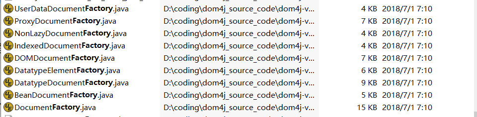
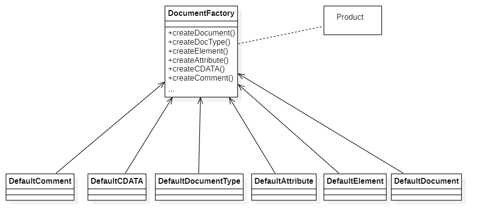
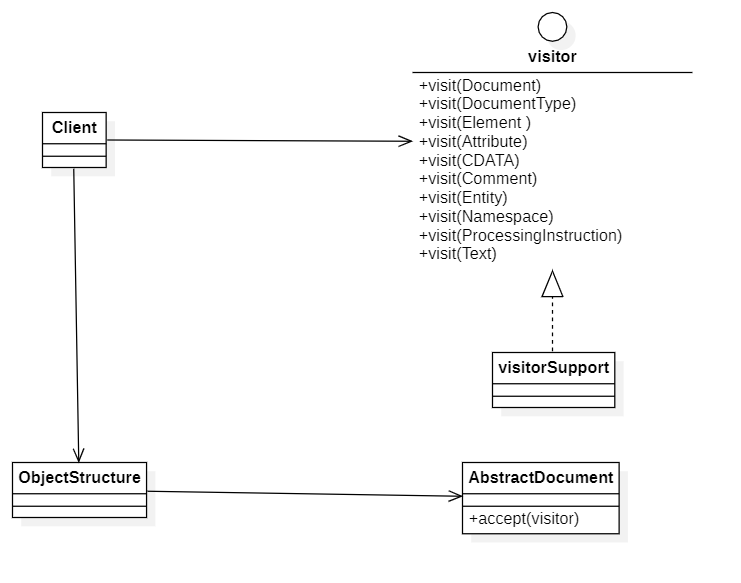

### dom4j高级设计意图分析

在dom4j中涉及了诸多设计模式，本章节的内容就是对项目中可能使用到的模式进行简析。除了第1章谈到的过滤器模式之外，还涉及如下的模式。

#### 工厂模式

>**意图：**工厂模式定义了一个用于创建对象的接口，让子类决定实例化哪一个类。工厂方法使一个类的实例化延迟到其子类。
>
>**方案：**针对接口编程，隔离掉以后系统可能发生的改变。工厂方法不再将与特定应用有关的类绑定到代码中，比直接创建对象更加灵活。

在dom4j中，观察文件命名风格上面就可以看到许多工厂类的文件名：



其中本章关注的主要是章节2中涉及的那个工厂：`DocumentFactory`

下面是`DocumentFactory`类的代码

```java
@SuppressWarnings("unused")
public class DocumentFactory implements Serializable {
...
    // Factory methods
    public Document createDocument() {
        DefaultDocument answer = new DefaultDocument();
        answer.setDocumentFactory(this);

        return answer;
    }
    
    public Document createDocument(String encoding) {
        Document answer = createDocument();

        answer.setXMLEncoding(encoding);
        return answer;
    }

    public Document createDocument(Element rootElement) {
        Document answer = createDocument();
        answer.setRootElement(rootElement);

        return answer;
    }

    public DocumentType createDocType(String name, String publicId,
            String systemId) {
        return new DefaultDocumentType(name, publicId, systemId);
    }

    public Element createElement(QName qname) {
        return new DefaultElement(qname);
    }

    public Element createElement(String name) {
        return createElement(createQName(name));
    }

    public Element createElement(String qualifiedName, String namespaceURI) {
        return createElement(createQName(qualifiedName, namespaceURI));
    }

    public Attribute createAttribute(Element owner, QName qname, String value) {
        return new DefaultAttribute(qname, value);
    }

    public Attribute createAttribute(Element owner, String name, String value) {
        return createAttribute(owner, createQName(name), value);
    }

    public CDATA createCDATA(String text) {
        return new DefaultCDATA(text);
    }

    public Comment createComment(String text) {
        return new DefaultComment(text);
    }

...
}

```

由于工厂方法`createXXX`过多，因此上面只列举了一部分。由此可以看到这个类的几个特点：

1. 负责生产的类比较多，从阅读结果来看，这个类基本上将所有章节2中提到的XML组成部分都给创建了至少1个`createXXX`方法
2. 对于部分类，比如说`Document`和`Element`等，有好几个重载的`create`方法。

首先分析一下`createDocument`，默认的无参数方法是通过创建`DefaultDocument`这个类的实例，通过类型转换返回一个`Document`，而别的重载方法则是首先调用这个无参方法，然后再在返回的`document`实例上面做加工返回。根据官方的说明，`DefaultDocument`为XML`document`元素的默认的DOM4J实现。之所以使用各种重载的方法，根据注释的解释，是为了保持`DocumentFactory`向后兼容，这样子类只需要扩展`createDocument()`方法。这种设计思路符合面向对象SOLID原则中的开放-封闭原则

> 开放-封闭原则，是说软件实体（类、模块、函数等）应该可以扩展，但是不可以修改

其余的`createXXX`也是类似的模式，都是默认创建一个`DefaultXXX`的类，返回时进行类型转换。不得不说dom4j的命名真的很规范。这个模式的UML图大致如下所示



由于这个工厂负责生产的类太多，因此这里仅仅列举了一小部分。由此也可以看出，似乎这个工厂类还有改进的余地。对于过于复杂的功能，应该分割成各个小工厂来实现，也就是应该声明诸如`ElementFactory`、`AttributeFactory`之类的工厂来分割任务，更加符合设计原则中的单一职责原则

> 单一职责原则：就一个类而言，应该仅有1个引起它变化的原因。


#### 单例模式

> **意图：**保证一个类仅有1个实例，并提供一个访问它的全局访问点
>
> **方案：**仅仅使用全局变量无法保证实例化多个相同的对象，更好的办法是让类自身负责唯一的实例，保证没有其他实例被创建，并且只能由它提供一个访问该实例的方法。

就在上面分析工厂模式的时候，注意到代码中出现了`Singleton`关键词。在`DocumentFactory`里面相关的代码布局如下所示

```java
public class DocumentFactory implements Serializable {
    private static SingletonStrategy<DocumentFactory> singleton = null;
...

    private static SingletonStrategy<DocumentFactory> createSingleton() {
        // Singleton();
    	...
    }

...

    public static synchronized DocumentFactory getInstance() {
        // getInstance();
    	...
    }

    // Factory methods
...
}
```

其中根据dom4j给出的指南，`SingletonStrategy`是一个接口，它用于给基于单例策略实现的同一对象，提供通用的工厂访问。单例的创建过程大致为

```java
private static SingletonStrategy<DocumentFactory> singleton = null;
```

先定义这个单例，但是初始值设为`null`

```java
public static synchronized DocumentFactory getInstance() {
    if (singleton == null) {
        singleton = createSingleton();
    }
    return singleton.instance();
}

```

这一块是对应到`Singleton`的`getInstance`方法，可以看到命名都是保持一致的。

至于使用到的`createSingleton()`方法，对应的就是本设计模式中的`Singleton`初始化的方法，代码如下所示

```java
private static SingletonStrategy<DocumentFactory> createSingleton() {
        SingletonStrategy<DocumentFactory> result;
        
        String documentFactoryClassName;
        try {
            documentFactoryClassName = System.getProperty("org.dom4j.factory",
                    "org.dom4j.DocumentFactory");
        } catch (Exception e) {
            documentFactoryClassName = "org.dom4j.DocumentFactory";
        }

        try {
            String singletonClass = System.getProperty(
                    "org.dom4j.DocumentFactory.singleton.strategy",
                    "org.dom4j.util.SimpleSingleton");
            Class<SingletonStrategy> clazz = (Class<SingletonStrategy>) Class.forName(singletonClass);
            result = clazz.newInstance();
        } catch (Exception e) {
            result = new SimpleSingleton<DocumentFactory>();
        }

        result.setSingletonClassName(documentFactoryClassName);
        
        return result;
    }
```

大致的流程就是声明一个`SingletonStratege`的实例，然后在两次例外处理机制下处理单例内部属性的初始化，最后返回单例的实例。

综合来看，`DocumentFactory`的单例模式类似于懒汉模式的实现方式，由于有`synchronized`关键词，线程是安全的。

```java
public class Singleton {
    private static Singleton instance;
    //private static SingletonStrategy<DocumentFactory> singleton = null;
    private Singleton(){}
    //private static SingletonStrategy<DocumentFactory> createSingleton(){...};
    public static synchronized Singleton getInstance() {
        if (instance == null){
            instance = new Singleton();
        }
        return instance;
    }
    //public static synchronized DocumentFactory getInstance() {...}
}
```


#### 访问者模式

> **意图：**表示一个作用于某对象结构中的各元素的操作。它可以在不改变各元素的前提下定义作用于这些元素的新操作。
>
> **方案：**访问者模式适用于数据结构相对稳定的系统，使用它以将结构本身和作用于结构上面的方法进行解耦，使得对这些方法进行修改时对整体系统造成的影响较小。每增加1个新的方法，就相当于增加一个新的访问者

在dom4j中，存在一个`visitor`的接口。它就是访问者模式中的“抽象访问者接口”这一成员的实现。该接口的对象可以传递给`Node`，然后调用其类型安全的方法。

```java
public interface Visitor {
    void visit(Document document);

    void visit(DocumentType documentType);

    void visit(Element node);

    void visit(Attribute node);

    void visit(CDATA node);

    void visit(Comment node);

    void visit(Entity node);

    void visit(Namespace namespace);

    void visit(ProcessingInstruction node);

    void visit(Text node);
}


```

这个接口很直接地重载多次`visit`方法，实现对XML文件各个部分的访问，可以看到每个部分都有一个专属的`visit`方法。而在这些部分对应的`abstractXXX`类里面，均对`visitor`定义了一个`accept`方法，这里以`AbstractDocument`为例：

```java
public void accept(Visitor visitor) {
    visitor.visit(this);

    DocumentType docType = getDocType();

    if (docType != null) {
        visitor.visit(docType);
    }

    // visit content
    List<Node> content = content();

    if (content != null) {
        for (Node node : content) {
            node.accept(visitor);
        }
    }
}
```

此方法接受一个visitor的访问，并检查自己的`docType`属性，如果存在的话，则让`docType`被访问，然后再遍历地访问`content`属性。

对于接口`visitor`，由`visitorSupport`实现

```java
public abstract class VisitorSupport implements Visitor {
    public VisitorSupport() {
    }

    public void visit(Document document) {
    }

    public void visit(DocumentType documentType) {
    }

    public void visit(Element node) {
    }

    public void visit(Attribute node) {
    }

    public void visit(CDATA node) {
    }

    public void visit(Comment node) {
    }

    public void visit(Entity node) {
    }

    public void visit(Namespace namespace) {
    }

    public void visit(ProcessingInstruction node) {
    }

    public void visit(Text node) {
    }
}
```

因此大致的UML图如下所示：



其中具体访问何种`Document`，上图没有画出来，具体应该是`DefaultDocument`为基础的实际检索到的`Document`实例。而具体的visitor，实际上是由用户创建的，也就是说dom4j支持使用这种模式访问文件树结构，因此也没有画出来。

GOF中的1位关于此模式曾说过，大多数时候用不到访问者模式，但是一旦需要使用它时，那就真的需要使用了。dom4j的编写者明显是用到了这种模式，说明他们对于代码的功能定位十分清晰，令人佩服。

